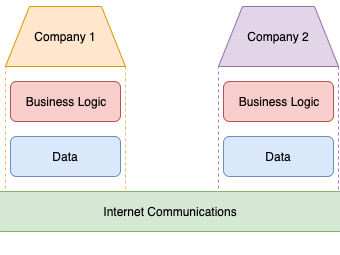

# Distributed Ledger Technology

## Ledgers and State

A ledger is just a record of transactions which have occurred. For example a bank ledger contains the transactions of all the exchanges of balance between its users, for example :

    Bob wants to send Alice £5. A transaction will be made such that 
        Bob =£5=> Alice

This transaction is then recorded into the ledger. The ledger is ordered and shows each transaction from the start to the latest state.

State is very simple, its just the overall status of all the accounts on the ledger. For example:

    Bob currently has £60, Alice has £20, and Richard is a new customer, the state is represented as
        Bob     : £60
        Alice   : £20
        Richard : £0

States and ledgers go hand in hand, ledgers contain transactions which alter the state. Using the ledger we can compute the latest state by applying all the transactions in the order they occurred from the genesis state.

## Distributed Architecture

**Before explaining what distributed architecture is; it is best to make explicit that there is a difference between Distributed and Decentralized architecture.**

Architecture types can be considered on a scale where Centralised is on one extreme and Distributed on the other extreme, with Decentralised being some place in between the extremes. Each of these networks are made up of peers within them. Where as centralised network has 1 central point of communication between all the nodes, distributed networks has no central peer to communicate and transmit data between; instead peers communicate directly to other peers.

Distributed architectures, also called mesh networks, are very resilient and cheap. The network contains very diverse peers of varying quality in communication links and the machines themselves, thus creating a relatively cheap network. Having no Central part of the system results in high resilience since there is no central point of failure; every node has to fail in order for the network to fail. The other advantage is geographic spread since the network can grow just by adding new nodes that connect to the closest nodes.

## Distributed Ledgers

> So how and why do ledgers and distributed networks go together?

Lets look at the Bank example again. Banks maintain a ledger in a centralized architecture, wherein every transaction has to go through the central authority. Once the central authority has accepted the transaction, the ledger is updated with that transaction.

Now if we had the same situation in a distributed architecture, there is no central authority controlling and maintaining the ledger. Since there is no one entity controlling the ledger who do we send the transactions to? In short the answer is everyone. Each peer, collectively, maintains and controls the ledger; and as such the transactions which can join the ledger. Peers on the network have to agree that a transaction is legit and once the majority of the network agrees on the correctness of the transaction, that transaction enters the ledger.

Another thing to point out is that the ledger is distributed among every peer. I.e. every person has a copy of the ledger. So when the network agrees for a transaction to join the ledger, it effectively means that every peer has to add that transaction to their ledger. This means that every peer has the exact same ledger as the surrounding peers.

There may be a lot of questions about certain unclear aspects such as, How do the peers agree on what transactions enter the ledger? The answer to that question has quite an in depth answer which you can research; but essentially there are consensus algorithms which are used in distributed systems to ensure that peers reach an agreement about something, i.e. a transaction. But for this project I will highlight a very high level transaction flow in a distributed ledger, which should give a clearer picture about what is happening:

    Bob will send Alice £5 
        [Bob =£5=> Alice]
    Bob will send this transaction to every peer on the network.
    Everyone will validate that the transaction is legit 
        [For example does Bob have enough money to send]
    Once the majority of the network has agreed its legit, everyone will add the transaction to their ledger 
        [They will agree through a consensus protocol]
    Everyone has updated their ledger and this transaction has now been officially recorded
        [Thus having the same effect as a bank updating their ledger]

It seems like a neat concept, but now begs the question why is this important or game changing?

## Smart Contracts and Chain code

In almost every single Distributed Ledger Technology there is a concept called smart contracts (or chain code, depending on the implementation). Essentially a smart contract is a script, or piece of code that manipulates the state of the ledger by generating transactions on behalf of the executor. You can encapsulate logic into the smart contracts which, when deployed, can be executed by people on the network. For example, it wouldn't be such a bad idea to implement a voting contract, which allows 1 person to vote for something and after a certain point in time will count up the number of votes for and against the idea. Its a very simple smart contract but with a very forward thinking ideal; there is no longer a need for a trusted third party to count and collect votes, instead can be done in an incorruptible, unbiased smart contract. Smart contracts add extra logic to a Distributed Ledger so that ledger transactions can be generated and executed in a logical fashion (business logic).

## Benefits of Distributed Ledger Technologies

-  Disintermediation

    With all Distributed system you have completely removed a centralised authority and more often than not, an unneccessary middleman. Napster is a great example of this, they completely changed the music industry. Rather than people having to buy music and obtain music solely through the records labels, Napster allowed users to share music with other users on the network. Whilst Napster had a few issues with copyright and illegal distribution its system changed to music industry. Music artists realised that they could share their music directly with the consumer without the need for a record label be an unneccessary middle man. With the use of smart contracts it is possible to remove intermediatries that faciliate the exchanging of this data. For example, you would be able to transfer an asset (i.e. a house) directly to the buyer without the need of an estate agent to facilate the exchange. A smart contract would be written to exchange the owner of the house from the current owner to the buyer. There are alof of industries and companies built solely on being a middleman to facilitate interactions between entities.

-  Immutability of Transactions

    What may not be apparent in the explaination above is that once a transaction has entered a ledger it is impossible (not entirely true, due to the consensus protocols) to remove that transaction or alter it in any way. This immutabililty of transaction records an unbiased true account of what has occured throughout history. The immutability of transactions means that people are held accountable for their transactions. People cannot dispute that a transaction hasnt occured since everyone agreed on that transaction and this transaction cannot be changed. Since transaction cannot be alter in anyway this builds in an anti-censorship gate, where nothing can be censorsed. Take the bank example, they solely maintain their ledger, they could, in theory, alter the accounts and transactions of its users effectively censoring the data.

-  Trustless (Somewhat)

    Depending on how a DLT is implemented it can be completley trustless and completely distributed. The ways which DLTs can be completely trustless is the way in which each peer talks to each other. A peer doesnt trust any other peer, but it trusts itself, having this distrust creates a philosphy of verify everything. Every peer will verify every transaction it retrieves without having to trust the peer that sent it. This way by default everybody verifies if a transaction is legit or not then everyone comes to an agreement about the overall cosensus about if the transaction should be added. This trustless, verify first, behaviour creates a system which is resilient to bad actors. However this is to say that everything is at mercy of the consensus of the network. For example, a peer may think that a transaction is good but the overall consensus of the network was that the transaction was bad, this transaction will not enter the ledger. True, unbiased democracy.

## DLT's Effect on the Business Stack

You may understand what a Distributed Ledger is and the benefits it can bring with it. But you may now ask, where do Distributed Ledgers fit in the overall picture. I like to call the overall picture the Business Stack:

Before the Internet the Business Stack looked like :

With the Internet came an updated stack :

With DLTs come this updated stack:

## Final Remarks