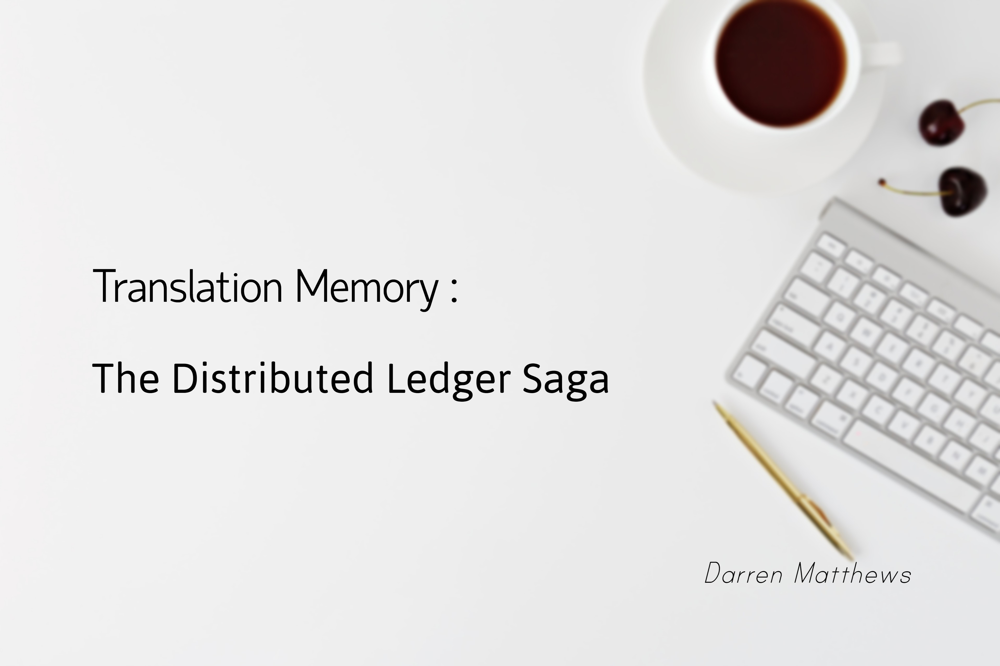

<div style="text-align:center"></div>

# Third Generation Translation Memory

This project aims to combine the Translation Memory with Distributed Ledger Technology. This framework/network aims to be the place to work for every linguist by adding :

-  Linguistic Identity
-  Standardizing the industry with a basic set of processes
-  Self-sovereignty of data within the Network (clearly defined ownership)
-  Secure by design
-  Open collaboration in expanding processes and standards

Please read the proposal which will outline more in-depth about how and why this is the next big thing. The project's proposal is [here](./docs/index "Proposal").

<br/>

---

<br/>

## Prerequisites

Add `fabric` and `fabric-ca` binaries to the path in order for the scripts and CLI interactions to behave correctly.

Download the latest releases for [`fabric`](https://github.com/hyperledger/fabric/releases) and [`fabric-ca`](https://github.com/hyperledger/fabric-ca/releases)

Unzip and and add the *`bin`* folders of each to the `PATH` of your machine. Please refer to specifics of your local machine for adding binaries to the `PATH`

<br/>

## Running the Network

It is expected to run using a Unix based environment (WSL is recommended for Windows). Before running the network ensure that you have install the below prerequisites outlined [here](https://hyperledger-fabric.readthedocs.io/en/latest/prereqs.html "Hyperledger PreReqs").

-  Git
-  cURL
-  Docker

To create the basic network navigate to the *network* folder and run the *start-network.sh* script:

```
cd network
./start-network.sh
```

To destroy the basic network simple navigate to the *network* folder and run the *destroy-network.sh* script:

```
cd network
./destroy-network.sh
```

> Ensure Docker Daemon is running before starting/destroying the network.